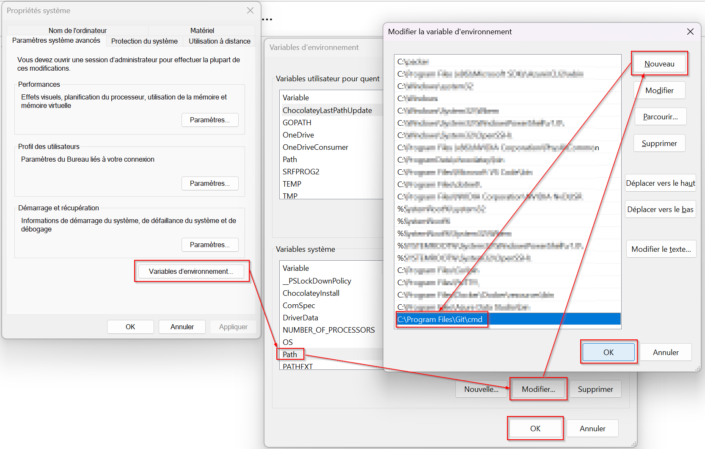

# Installation de git

[Windows](https://gitforwindows.org/){ .md-button }          [Linux](https://git-scm.com/book/en/v2/Getting-Started-Installing-Git){ .md-button .md-button--primary }          [MacOS](https://git-scm.com/download/mac){ .md-button }  

<!-- === "Windows"
    ```bash
    docker run --rm -it -v ${PWD}:/docs squidfunk/mkdocs-material build
    ```

=== "Linux"
    ```bash
    docker run --rm -it -v "%cd%":/docs squidfunk/mkdocs-material build
    ``` -->

## Linux

=== "Ubuntu/Debian"
    ```bash
    sudo apt update
    sudo apt install git
    ```

=== "CentOS/RHEL"
    ```bash
    sudo yum install git
    ```
    
=== "Fedora"
    ```bash
    sudo dnf install git
    ```

## Windows

## MacOS
to do...

# Variables d'environnements

Sur Windows, il peut être nécéssaire d'ajouter une variable d'environnement git pour pour que Git puisse être accessible depuis n'importe quel terminal ou invite de commande sans avoir à naviguer vers le répertoire d'installation de Git. Cela simplifie grandement l'utilisation quotidienne de Git.

## 1. Ouvrir les Paramètres Système
- Clic droit sur **l'icône Ce PC ou Ordinateur sur le Bureau ou dans l'Explorateur de fichiers**.
- Cliquez sur **Paramètres avancés du système**.
- Dans l'onglet **Propriété système**, cliquez sur le bouton **Variables d'environnement** en bas.

## 2. Modifier les variables d'environnement
Dans la fenêtre **Variables d'environnement** :

- **Variables utilisateur** : Affecte uniquement l'utilisateur actuel.
- **Variables système** : Affecte tous les utilisateurs sur le système.

### Modifier une variable
1. **Sélectionnez** la variable que vous souhaitez modifier. Par exemple, si vous voulez modifier le `PATH` pour inclure un chemin vers Git.
2. Cliquez sur **Modifier**.
3. Dans la boîte de dialogue qui apparaît, vous pouvez ajouter, modifier ou supprimer des valeurs.

### Ajouter une nouvelle variable
1. Sélectionner la variables systèmes **Path** puis modifier la.
2. Cliquer sur **Nouveau** puis ajouter le chemin où se trouve git (pour ma part : C:\Program Files\Git\cmd)
3. Cliquez sur **OK** pour enregistrer la nouvelle variable (2 fois).



## 4. Vérifier les modifications
Après avoir configuré la variable, vous pouvez vérifier que Git les utilise correctement :

1. Ouvrez un terminal `cmd` ou `powershell`.
2. Tapez `git` et vérifier si cette commande vous retourne des instrutions Git (penser à bien fermer et ré-ouvrir vos terminals cmd, powershell afin que la variable d'environnement puisse être utilisé. Si ce n'est pas le cas, il faut recommencer l'opération.)


